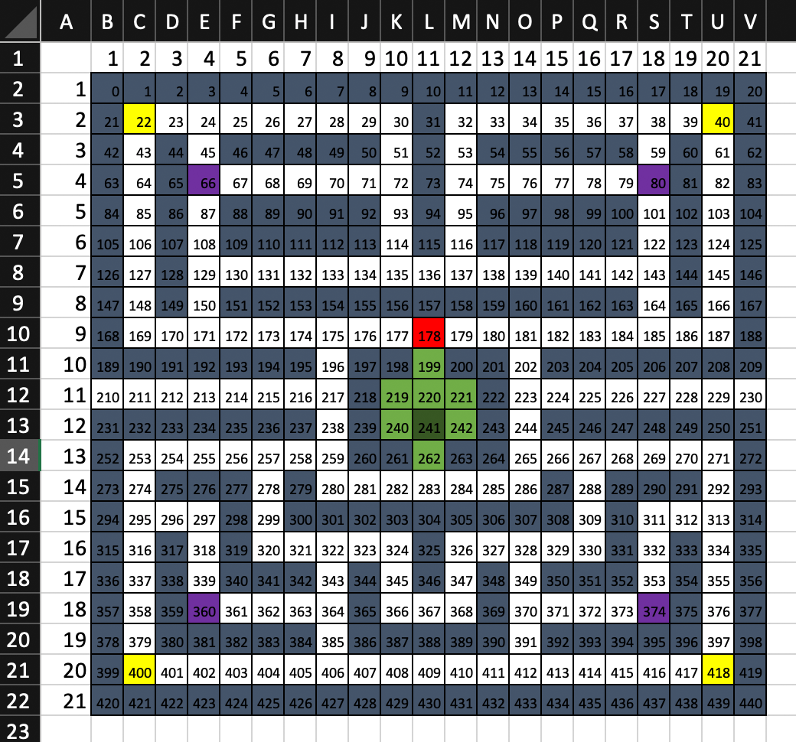

###  General Assembly, Software Engineering Immersive
# Vac-Man 
 

## Overview

This is my first project of the software engineering immersive course at GA London. The assignment was to create a grid-based game to be rendered in the browser, using HTML, CSS and JavaScript. The project was to be completed **individually** within **one week**.

Given a list of options from GA, I chose to re-create the classic game **Pac-Man**. Please note that while the game is designed in terms of roombas and cats, this documentation is written in terms of the original Pac-Man lingo, e.g. referring to _ghosts_ and _energizers_, as the underlying code also uses this jargon. 

You can launch the game on GitHub pages [here](https://katheich.github.io/vac-man/), or find the GitHub repo [here](https://github.com/katheich/vac-man).

## Brief

- **Render a game in the browser**
- **Design logic for winning & visually display which player won**
- **Include separate HTML / CSS / JavaScript files**
- Stick with **KISS (Keep It Simple Stupid)** and **DRY (Don't Repeat Yourself)** principles
- Use **Javascript** for **DOM manipulation**
- **Deploy your game online**, where the rest of the world can access it
- Use **semantic markup** for HTML and CSS (adhere to best practices)

## Technologies used 

- HTML
- CSS
- JavaScript (ES6)
- Git and GitHub
- Photoshop Elements
- Google Fonts
- Microsoft Excel

## Approach

### Board layout 

- Used a single array of continuously increasing numbers to track the cells
- Created two basic functions to navigate this array as intended:
  - `getXY`: for each cell, calculate the X and Y coordinate (used for distance calculations)
    ```js
    function getXY(position) {
      const y = Math.floor(position / width) + 1
      const x = position % width + 1                                       

      return [x, y]
    }
    ```
  - `getNeighbourCell`: based on the cell you're on and the direction you're heading, determine which cell is the one you will land on (allows moving through the walls to appear on the opposite side)
    ```js
    function getNeighbourCell(position, direction) {
      switch (direction) {
        case 'up': return position < width ? position + (width * (width - 1)) : position - width
        case 'right': return (position - (width - 1 )) % width === 0 ? position - (width - 1) : position + 1
        case 'down': return position > (width * (width - 1)) - 1 ? position - (width * (width - 1)) : position + width
        case 'left' : return position % width === 0 ? position + (width - 1) : position - 1
      }
    }
    ```
- Everything else, i.e. walls, power-ups, player and ghosts, are simply classes assigned to these cells

- The grid layout was planned in Excel and turned into a corresponding array

  

### Ghost movement 
- A single function is used to determine each ghost's movement. Like in original game, ghosts only look one move ahead. The function starts from considering the 4 possible options that a ghost could move to and starts to narrow them down as follows:
  - Since ghosts cannot move into walls or backwards, choices only need to be made at intersections.
  - At an intersection, the as-the-crow-flies distance (straight line, ignores walls) to pac-man is calculated from each option and the one that is closest (in frightened state, pick the one that is furthest) is selected.
- All ghosts move the same way in the same interval, the different behaviour solely emerges from different starting points.
- In order to avoid the ghosts 'fusing together' as a result, if two ghosts bump into each other, they will reverse and keep going. 

```js
  function moveGhost(ghostHistory) {

    let ghostOptions = [getNeighbourCell(ghostHistory[0], 'up'), getNeighbourCell(ghostHistory[0], 'right'), getNeighbourCell(ghostHistory[0], 'down'), getNeighbourCell(ghostHistory[0], 'left')]

    // DISCARD WALLS AND PREVIOUS LOCATION
    ghostOptions = ghostOptions.filter((option) => {
      return !(cells[option].classList.contains('wall') || option === ghostHistory[1])
    })

    // SET NEW POSITION
    let newGhost = 0
    if (ghostOptions.length > 1) {

      let minDistance = 30 // theoretical maximum
      let maxDistance = 0 // theoretical minimum

      const distances = ghostOptions.map((cell) => {

        const playerXY = getXY(player)
        const newGhostXY = getXY(cell)

        const distance = Math.sqrt((playerXY[0] - newGhostXY[0]) ** 2 + (playerXY[1] - newGhostXY[1]) ** 2)

        distance < minDistance ? minDistance = distance : minDistance
        distance > maxDistance ? maxDistance = distance : maxDistance

        return distance
      })

      if (!frightened) {
        newGhost = distances.indexOf(minDistance)
      } else {
        newGhost = distances.indexOf(maxDistance)
      }

      (...)
    }
  }
```


### Game timing 
- Ghosts are on set intervals, moving one at a time using the algorithm in `moveGhost` which was described above.
  ```js 
    ghostInterval = setInterval(() => {
      for (let i = 0; i < 4; i++) {
        ghostHistories[i] = moveGhost(ghostHistories[i])
      }
    }, 300)
  ```
- For the player, there is an Eventlistener on the window, listening for WASD input from the player.
  ```js
    document.addEventListener('keydown', e => {
    switch (e.key) {
      case 'w': {
        const cellIndex = getNeighbourCell(player, 'up')
        cells[player].classList.remove('player', 'up', 'right', 'down', 'left')     
        player = movePlayer(cellIndex)
        cells[player].classList.add('player', 'up')
        break
      }
      (...)
    }
  }
  ```

### Collisions 
- As an overlap of classes could be too brief to detect all collisions reliably (i.e. if timed correctly, pac-man could 'pass through' a ghost), I implemented a player shadow around all cells of the player that would all be considered as collisions if a ghost hit them.
  ```js
  playerShadow = [getNeighbourCell(player, 'up'), getNeighbourCell(player, 'right'), getNeighbourCell(player, 'down'), getNeighbourCell(player, 'left')]
  ```
- There are checks for collisions both in the movements of the ghosts and the player
  - in `moveGhost`:

    ```js
    if (cells[ghostHistory[0]].classList.contains('player') || playerShadow.includes(ghostHistory[0])) {
      ghostHistory = collideWithGhost(ghostHistory)
    } 
    ```
  - in `movePlayer`:
  
    ```js
    else if (newPosition.classList.contains('ghost')) {
        for (let i = 0; i < 4; i++) {
          if (ghostHistories[i].includes(player)) {
            ghostHistories[i] = collideWithGhost(ghostHistories[i])
          }
        }
    } 
    ```

### Power-ups and 'frightened' state 
- When pac-man eats an energizer, a global boolean 'frightened' is toggled from false to true for 10 seconds.
- If another energizer is consumed when the boolean already had the value true, the timer is reset to 10 seconds from the time of consumption of the last energizer.
- Various behaviours are different when this boolean is true, namely:
  1) Ghosts choose the cell furthest away from pac-man, not closest
  2) If pac-man collides with a ghost, 100 points are added to the score and the ghost is relocated to the ghost-pen
  3) The CSS class frightened changes the look of the ghosts
- A countdown was added to alert the player of the time the game is remaining in the frightened state.

### Variables 
At all times various variables are used to keep track of things happening in the game:

- `player`: the index of the cell the player is on
- `playerShadow`: keeps track of all cells around the player in an array, to improve collision detection
- `ghostHistories`: the location of all 4 ghosts in an array, in which each ghost has their own array of their current and immediately preceding position (also as cell indeces)
- `frightened`: a boolean that is at all times either false (base state) or true (for 10 seconds after an _energizer_ is consumed)
- `score`: every time the player moves onto a cell with the _food_ class on it, 1 is added to the score; if the player collides with a _ghost_ while the state _frightened_ is true, 100 is added to the score.
- `lives`: starts at 3 and every time the player collides with a non-frightened _ghost_, 1 life is taken away; if `lives === 0`, the player has lost and the game ends.
- `foodCount`: counts down from the total amount of food on the board (200) every time the player lands on a cell with the _food_ class on it; if it `foodCount === 0`, the player has won and the game ends.

### Non-game screens

- To simplify the display, I decided to always wipe the grid at the centre of the screen and display a new message div over it. For instance, when the game ends, the following function is called:

```js
// END GAME SCREEN
  function endGame(state) {

    // CLEAR VARIABLES
    clearInterval(ghostInterval)
    grid.innerHTML = '' 
    cells = []

    grid.appendChild(messageScreen)

    // VICTORY SCREEN
    if (state === 'win') {
      messageScreen.innerHTML = `You won! Your score was ${score}.`

      (...)
    }
  }
```


## Screenshots


## Bugs 

- In spite of the 'player shadow' described above, the collisions are still not 100% reliable - sometimes pac-man can 'pass through' a ghost.

## Potential future features

- Server-side saved scoreboard
- Mobile-compatibility
- Different behaviour for each 'ghost', more complexity
- Further levels


## Lessons learned

- Adding a 'play again' feature was more trouble than anticipated, as initially the new grid would just be added to the array of the old grid, so everything happening there was not visible. As a solution, the centre screen gets wiped completely every time something new is displayed.

- Though in theory collisions based on pac-man and the ghost being on the same cell should suffice, due to the processing lag, it was necessary to add a 'player shadow' to allow for collisions to be correctly detected in a wider area (and it's still not working all the time!)

## Artwork and credit

Except for GIF after victory, all artwork is my own. 

GIF from Giphy: https://gph.is/2mHDXA2.


